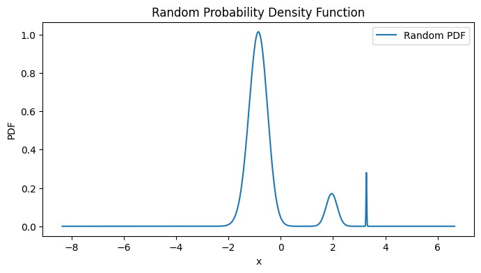
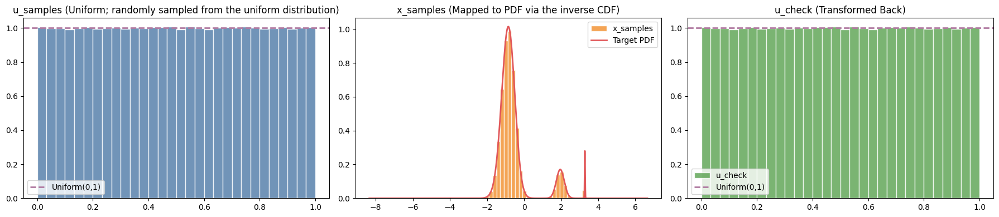
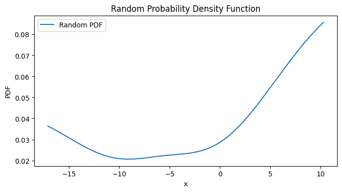
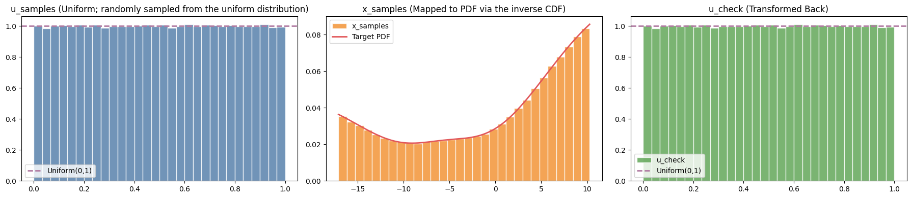

# CDFs: Using Code to Write CDFs and Inverse CDFs for Random Functions

A Python library for generating random continuous functions and transforming them into probability density functions (PDFs), then computing their cumulative distribution functions (CDFs) and inverse CDFs for perfect uniform distribution mapping.

## Overview

This project explores the mathematical relationship between continuous probability distributions and uniform distributions through the inverse CDF transformation. The core insight is that any continuous random variable can be transformed into a uniform distribution by applying its CDF, and conversely, any uniform random variable can be transformed into any desired distribution using the inverse CDF. This discovery is not new. The project is aimed as a learning exploration to exhibit a well accepted statistical property called probability integral transform. 

## Examples

Users can generate infinitely many example PDFs and their transformation but here are four that I have pre-generated for an idea of what can be achieved:



*Example of a generated random continuous function*



*Three-panel visualization for the first function: uniform samples → transformed samples → verification*



*Another example showing different function characteristics*



*Another example of the complete CDF transformation process*

These images demonstrate the diversity of functions that can be generated and the perfect uniform mapping achieved through the CDF transformation.

## Key Features

- **Random Continuous Function Generation**: Creates diverse continuous functions with varying location, scale, skewness, tail heaviness, support bounds, multimodality, and underlying distribution types
- **PDF Generation**: Converts arbitrary continuous functions into normalized probability density functions
- **CDF and Inverse CDF Computation**: Builds cumulative distribution functions and their inverses using numerical integration
- **Perfect Uniform Mapping**: Demonstrates how the inverse CDF transforms uniform samples into samples from the target distribution
- **Comprehensive Testing**: Extensive test suites ensuring mathematical correctness and numerical stability

## Project Structure

### Core Modules

#### `py_files/random_function.py`
The heart of the random function generation system. Creates continuous functions that vary across seven key dimensions:

1. **Location (mean/shift)** – moves the distribution left or right
2. **Scale (variance/spread)** – makes it wider or narrower  
3. **Skewness** – symmetry vs lopsided (normal vs lognormal)
4. **Tail heaviness (kurtosis)** – light tails vs heavy tails (normal vs t-distribution)
5. **Support bounds** – some distributions are on (-∞, ∞), some on [0, ∞), some on finite intervals
6. **Multimodality** – single peak vs multiple peaks
7. **Underlying distribution** – gaussian, polynomial, sinusoidal, etc.

**Key Functions:**
- `create_random_function()`: Returns a continuous callable function with random parameters
- `visualize_random_function(f_x)`: Plots the generated function
- Helper functions for skewed Gaussian bumps, exponential-Gaussian convolutions, and various function families

#### `py_files/pdf.py`
Converts arbitrary continuous functions into normalized probability density functions. The key insight is that we square the function values to ensure non-negativity, then normalize by the integral to ensure the PDF integrates to 1.

**Key Functions:**
- `make_pdf(f, N=4000)`: Takes a continuous function and returns a normalized PDF over a random domain
- `visualize_pdf(p)`: Plots the generated PDF
- Includes adaptive recentering for functions that are numerically negligible on the first domain attempt

#### `py_files/cdf.py`
Implements the core CDF and inverse CDF functionality. Uses trapezoidal integration to build the CDF from the PDF, then creates interpolated functions for both the CDF and its inverse.

**Key Functions:**
- `cdf_and_q(pdf, xs)`: Builds CDF and inverse CDF, generates samples, and verifies the transformation
- `plot_cdf_transform(u_samples, x_samples, u_check, xs, pdf)`: Creates a three-panel visualization showing the uniform samples, transformed samples matching the target PDF, and the verification that applying the CDF back gives uniform distribution

### Test Suites

#### `py_files/cdf_test.py`
Comprehensive tests for the CDF implementation:
- Verifies uniform sample generation
- Tests that transformed samples match the target PDF
- Validates CDF monotonicity and bounds (starts at 0, ends at 1)
- Tests with known distributions (normal, exponential)
- Checks trapezoidal integration accuracy

#### `py_files/pdf_test.py`
Extensive tests for PDF generation:
- Ensures non-negativity (f(x) ≥ 0 for all x)
- Verifies piecewise continuity
- Tests normalization (∫f(x)dx = 1)
- Validates probability integration over intervals
- Checks domain consistency and numerical stability

#### `py_files/random_func_tests.py`
Tests for the random function generator:
- Verifies all seven conditions for CDF generation are met
- Tests function families (sin_sum, poly, gauss_mix, exp_sum, logistic_sum, tanh_rbf, skew_bump_mix, exgauss_mix)
- Ensures continuity and proper metadata structure
- Tests edge cases and extreme input values

### Jupyter Notebooks

#### `notebooks/continuous.ipynb`
Introduction to random continuous function generation. Explains the seven conditions that must be varied and demonstrates the function creation process.

#### `notebooks/pdf.ipynb`
Shows how to convert continuous functions into probability density functions. Emphasizes that this creates "sufficiently different and random PDFs" based on the continuous function, not a direct representation of it.

#### `notebooks/cdf.ipynb`
Demonstrates the complete workflow: generating a random function, converting it to a PDF, and then computing the CDF and inverse CDF for perfect uniform distribution mapping.

## Installation

This project uses Poetry for dependency management:

```bash
# Install dependencies
poetry install

# Activate the virtual environment
poetry shell

# Run tests
poetry run pytest py_files/ -v
```

## Usage

### Basic Workflow

```python
from py_files.random_function import create_random_function
from py_files.pdf import make_pdf, visualize_pdf
from py_files.cdf import cdf_and_q, plot_cdf_transform

# 1. Create a random continuous function
f = create_random_function()

# 2. Convert to PDF
xs, pdf = make_pdf(f)
visualize_pdf((xs, pdf))

# 3. Build CDF and inverse CDF, generate samples
u_samples, x_samples, u_check = cdf_and_q(pdf, xs)

# 4. Visualize the transformation
plot_cdf_transform(u_samples, x_samples, u_check, xs, pdf)
```

### Key Mathematical Concepts

**CDF Construction**: The CDF is built using trapezoidal integration:
```python
cdf_vals = np.cumsum((pdf[:-1] + pdf[1:]) * np.diff(xs) / 2.0)
```

**Inverse CDF**: Created by swapping the x and y coordinates of the CDF:
```python
Q = interp1d(cdf_vals, xs, bounds_error=False, fill_value=(xs[0], xs[-1]))
```

**Perfect Uniform Mapping**: 
1. Generate uniform samples: `u_samples = np.random.rand(1000000)`
2. Transform via inverse CDF: `x_samples = Q(u_samples)`
3. Verify by applying CDF back: `u_check = F(x_samples)` (should be uniform)

## Dependencies

- **numpy**: Numerical computations and array operations
- **scipy**: Statistical functions and interpolation
- **matplotlib**: Plotting and visualization
- **sympy**: Symbolic mathematics (for advanced use cases)
- **pytest**: Testing framework

## Development

The project includes comprehensive linting and formatting tools:

```bash
# Format code
poetry run black py_files/

# Lint code
poetry run flake8 py_files/

# Type checking
poetry run mypy py_files/

# Run tests with coverage
poetry run pytest py_files/ --cov=py_files
```

## Mathematical Background

The core mathematical principle is the **Probability Integral Transform**: if X is a continuous random variable with CDF F, then F(X) ~ Uniform(0,1). Conversely, if U ~ Uniform(0,1) and F is a CDF, then F⁻¹(U) has the distribution corresponding to F.

This project implements this transformation numerically:
1. Start with an arbitrary continuous function
2. Convert it to a valid PDF by squaring and normalizing
3. Build the CDF using numerical integration
4. Create the inverse CDF through interpolation
5. Demonstrate perfect uniform mapping

## License

This project is licensed under the terms specified in the LICENSE file.

---

**Disclaimer**: This README was written by AI based on the codebase comments and structure. The testing files were initially created by AI and then edited.